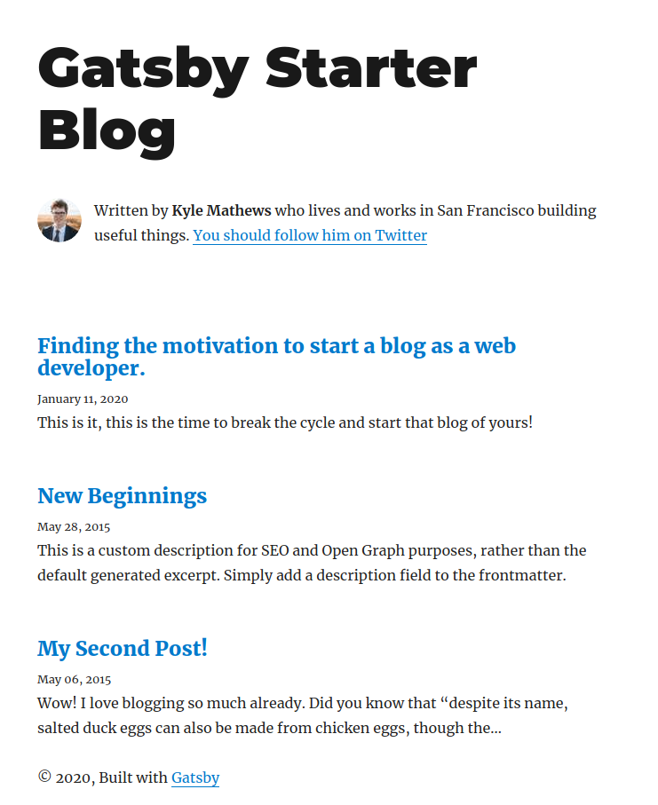
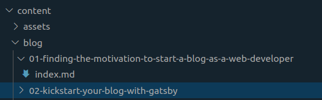
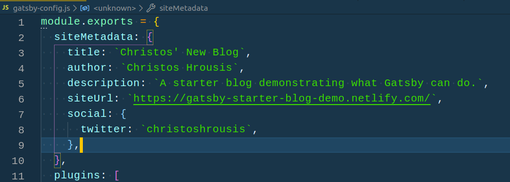
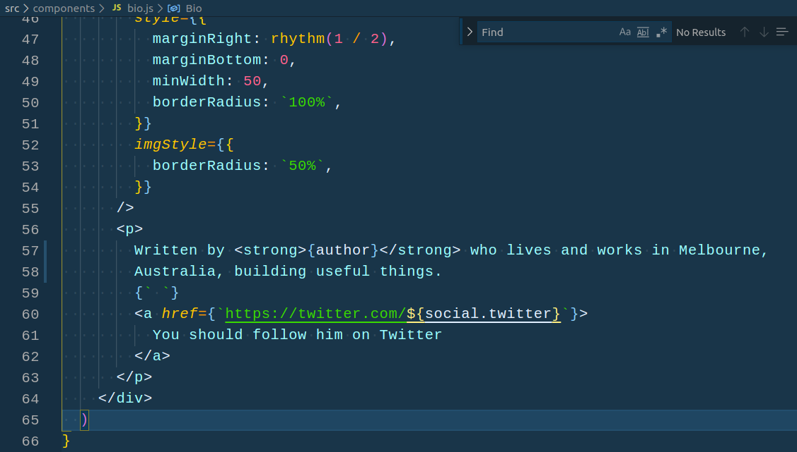
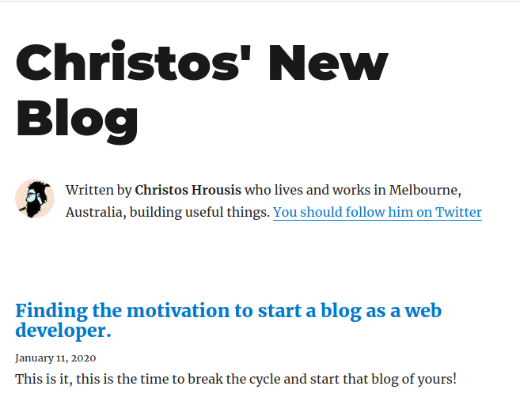

So, you've [found the motivation to start your blog,](/01-finding-the-motivation-to-start-a-blog-as-a-web-developer/) but you're not sure how to get started. For me, the answer is pretty straight forward and echoes mantras from my last post.

- Go with something you know
- Don't get to caught up on using the latest greatest tech
- Try to keep it simple, and avoid trying to get it right.

But if that's the case, then why is the title of this post hyping on Gatsby?

Well, apart from using Gatsby on the regular, ticking the box for familiarity for me, one of the draw cards for Gatsby for me when I first used it, was is the simplicity. Gatsby is the natural evolution of the time of static site generators of yesteryear like [https://middlemanapp.com/](https://middlemanapp.com/) and [https://gohugo.io/](https://gohugo.io/). Much like these generators, Gatsby does not require any explicit knowledge of Javascript to get started, just a willingness to read a few docs, and use the command line.

If we follow along with the [quickstart guide](https://www.gatsbyjs.org/docs/quick-start/), we just need to make sure we have the latest npm installed, and use the `gatsby-cli` to generate the site. So pop open your favourite terminal and type in:

`npm install -g gatsby-cli`

This will install the cli for us, which we can use to build our site. Now don't jump ahead here, we can use `gatsby new my-new-blog` to start a new project, but we want to cheat a little here. Kyle Mathews, writer of Gatsby, has put together a [starter](https://www.gatsbyjs.org/starters/gatsbyjs/gatsby-starter-blog/) for us to use. Gatsby has a great library of starters for you to go with, and we're going to go with the most used blog template starter there is. To create your blog from this starter, just do the following:

`gatsby new my-new-blog https://github.com/gatsbyjs/gatsby-starter-blog`

After a few seconds of installation, we're ready to go, cd into the directory `cd my-new-blog`, followed by a `gatsby develop` and we have a one-to-one copy of the gatsby-starter-blog for us to work with running at `localhost:8000`.

To get started, we can simply edit the existing blog posts, and make sure that we update the header so that we're no longer Kyle Mathews. Open the project you just created in your favourite editor, and navigate to `/content/blog` - You should see three folders, which correspond to each of the blog posts you see at your `localhost`. To get started, I suggest we rename the folders, following [this file naming convention](https://library.stanford.edu/research/data-management-services/data-best-practices/best-practices-file-naming). This will help later down the track and help arrange your posts in this folder for easy access. For this blog, I kept it simple and went with 2 digit starter numbers, you can also try using a date in there, but don't overthink it too much! My folders look a little something like this:

Once you're done renaming, dive into your 1st folder, and start working on the index.md file. This particular starter uses some variables to help with post ordering and titles/listing information. Update the title, date and description at the start of this document, and start writing your post in markdown below the `---` break. If you're not familiar with markdown, [you can start learning more about it here](https://www.gatsbyjs.com/guides/markdown/). As you're editing and updating, if you have your localhost open in another window, you get to see all your updates in real time thanks to Gatsby's hot reloading. Once we're done, we should see the updates reflected on the index page, and on the individual post's page for that blog post you've just edited.

Next, when we're happy with the amount of posts we've completed, we'll want to update the header bio to match our details a little better. Now, we will gloss over the specifics of how the react/javascript side of things work, but to update the bio we first need to update this file `/gatsby-config.js` and change some of the variables under `siteMetadata` to reflect what we want the bio to say. My metadata settings look a little something like this:

Once that is done, we can update the statement within the javascript template as we don't all work in San Fransisco ;) The file we're looking for resides at `/src/components/bio.js` and we want to edit the last few lines within the paragraph tags. Mine looks something like this:

And last but not least, we need to insert our own mugs in there. Find your profile pic of choice, rename in `profile-pic.jpg`, and replace the profile-pic file under `/content/profile-pic.jpg`. Once that's done, your local copy of your bio should look a little something like this:

And there you have it, a local copy of your very own, static, highly performant, website/blog. This _beast_ is almost ready to be published - so I'll revisit and update this blog post once I've [documented](https://www.garyvaynerchuk.com/creating-content-that-builds-your-personal-brand/) how to deploy to netlify~!
