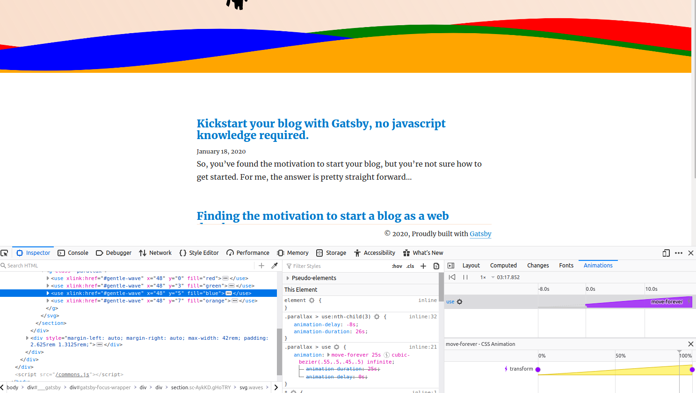

While working on my blog, I realised I would need to rework my website a little to accomodate the blog. I didn't really want to lose the simplicity of my personal branding, so I decided that the best course of action was to slap it to the top of the gatsby-starter-blog that I chose for my Gatsby blog.


This worked for the most part, but I felt it was missing that something special. So it was time to do some inspirational seeking on my favourite front-end website [Codepen](https://codepen.io/). They had recently released a list of [Top 100 Pens of 2019](https://codepen.io/2019/popular/pens) which in and of itself is amazing. In the top 10 I came across the [following pen](https://codepen.io/goodkatz/pen/LYPGxQz) by [goodkatz](https://codepen.io/goodkatz) at number 5! This Playstation-esque wave effect would act as a perfect divider for my blog - and was easy to implement thanks to the svg/css implementation, and the open nature of Codepen. (not to mention the free to use licence on this particular pen.)


I knew I couldn't really do a write up about it per se, I didn't make it after all, but if I'm to follow the self imposed rules of "Document, Don't Create" making a write-up about it is a little different, we need to talk about the process of what I went through to get it on my site. So we've covered what I needed, where I went to get inspiration, which conveniently also showcases how to implement it. But let's maybe take a look at how it actually works.


Taking a closer look at the internals of the SVG, you'll notice a single path, and a whole bunch of use tags that look a little like this: `<use xlink:href="#gentle-wave" x="48" y="0" fill="rgba(255,255,255,0.4)" />` if we take a look at the [Mozilla MDN for use](https://developer.mozilla.org/en-US/docs/Web/SVG/Element/use), we'll see that the `<use>` element duplicates a node within a SVG. Hopefully you can see how the SVG is actually quite legible in and of itself. A nice way to illustrate the shape of the path that is being duplicated is to apply some basic solid fill colors which better illustrate the pattern.


To get a better idea of how the animation works, we can either try to read the CSS or we can use Firefox's great suite of animation tools to better visualise what is going on.



Highlight a use node, which the css animations are set on, and we can clearly see how the static waves are being transformed on the x axis ever so slowly. Firefox's animation tools don't stop there. We can pause individual animations using the pause button at the top of the window to isolate the animations, and then we can either slow down the animation or manually control the timeline with the slider interface. If you edit the key-frames translation numbers, you'll notice that it breaks the infinite nature of the waves. Goodkatz has done a great job of lining up the animation loop to make the waves go on infinitely - for the moment I'm not 100% sure how this was calculated.


Either way, we can use Firefox's tools to make changes to the waves such as adding a transform on the y-axis. If you fiddle with the y-axis transform numbers you'll notice it breaks the infinite loop nature of the animation - but we can introduce a new step in the animation to add some y-axis transforms and make our visitors feel a little sea-sick when they visit our site. The moves-forever CSS animation looks something like this:

```css
@keyframes move-forever {
  0% {
    transform: translate3d(-90px, 0, 0);
  }
  100% {
    transform: translate3d(85px, 0, 0);
  }
}
```

Let's add a new step at 50%, we'll add 5px to the y-axis, and guesstimate where we will be on x-axis, let's just say 0px. This will give us something like this:

```css
@keyframes move-forever {
  0% {
    transform: translate3d(-90px, 0px, 0);
  }
  50% {
    transform: translate3d(0px, 5px, 0);
  }
  100% {
    transform: translate3d(85px, 0px, 0);
  }
}
```

We've now altered the animation to introduce a slight rise and fall in the waves, which is hard to notice, but should be subtle enough to add that extra dynamic element that improves the overall animation.

Hopefully this gives you an insight into how you can use Firefox to work out just how some animations work. Don't be afraid to experiment and tweak other's work on Codepen to try come up with something unique for yourself!
