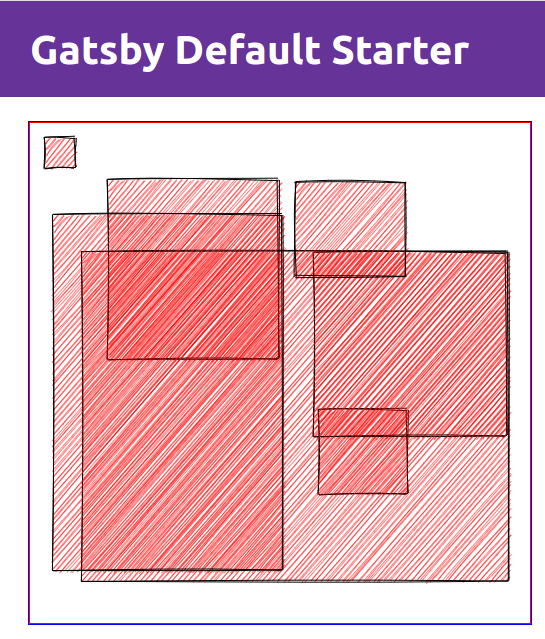

Sometimes you come across a great library, and it inspires you to do something. For me this time, I saw an update for [RoughJS](https://roughjs.com/) and knew I had to figure out how to make it work in Gatsby - so join me on a journey of learning how to draw a basic rectangle on the screen with Gatsby, React Hooks, and RoughJS.

Put one foot infront of the other, and generate your new project, and install some helper libraries:

```bash
gatsby new my-project
cd my-project
yarn add react-rough roughjs
yarn develop
```

Once that's sorted out, open up `pages/index.js`, and add some hooks we're about to use next to your react import, and import the ReactRough helper like so:

```javascript
import React, { useState, useEffect, useCallback, useRef } from "react"
import ReactRough, { Rectangle } from "react-rough"
```

Now don't expect anything super fancy here, but what we what is a div that represents the "drawing" area, and a div that represented the final outputted render. We'll also want to stack these on top of eachother. So we'll go with something like the following:

```javascript

const DrawArea = () => (
<div
  style={{
    display: "block",
    height: "500px",
    outline: "1px solid red",
    position: "absolute",
    width: "500px",
    zIndex: 2,
  }}
></div>
)

const Result = () => (
  <div
    style={{
      height: "500px",
      outline: "2px solid blue",
      position: "absolute",
      width: "500px",
      zIndex: 1,
    }}
  >
  </div>
)

const IndexPage = () => {

  return (
    <Layout>
      <SEO title="Home" />
      <DrawArea />
      <Result />
      </div>
    </Layout>
  )
}

```

Apart from helping compartmentalise some of the code, we can avoid some unneccissary re-renders by ensuring that the index page only renders on changes within the scope of it's own state, i.e. no state updates within the IndexPage function will trigger a re-render. The above will give us two blocks stacked on top of eachother.

Next up, let's setup the render output so we can see what's going on. We're going to update the Result component to loop over an array of objects, which represent a rectangle, then pass in an array with one rectangle in it so we can see what happens.

```javascript
const seed = 123456

const Result = ({ rectangles }) => {
  return (
    <div
      style={{
        height: "500px",
        outline: "2px solid blue",
        position: "absolute",
        width: "500px",
        zIndex: 1,
      }}
    >
      <ReactRough width={500} height={500}>
        {rectangles.map(rectangle => (
          <Rectangle
            key={rectangle.key}
            x={rectangle.x}
            y={rectangle.y}
            seed={seed}
            height={rectangle.height}
            fill="red"
            width={rectangle.width}
          />
        ))}
      </ReactRough>
    </div>
  )
}

const IndexPage = () => {
  const [rectangles, setRectangles] = useState([
    { key: Math.random(), x: 15, y: 15, width: 30, height: 30 },
  ])

  return (
    <Layout>
      <SEO title="Home" />
      <DrawArea />
      <Result rectangles={rectangles} />
      </div>
    </Layout>
  )
}

```

This will produce a 30x30 rectangle in the top left hand corner of the canvas area for us. Hopefully you notice in the update, that I've used "useState" to setup a state variable to represent an array of all the objects that represent rectangles. Then I've passed them as a prop to the result component, which then does a map over the rectangles to produce them. You can refer to the RoughJS to see what properties you can pass to your rectangle to change the way it looks. But for now let's keep going!

Next up we start working on the DrawArea component, now this one is a little more tricky, we need the following to occur:

- Hold a reference to the drawZone, so that we can watch for events.
- Keep track of the mouse position, within the bounds of the canvas, and relative to the canvas.
- Keep track of _when_ and _where_ we click down and hold.
- Keep track of _when_ and _where_ we release the mouse.
- Finally feed up the events to parent and `<Result/>` component

Typically we use `useRef` in this scenario we want to reference a node, but because we want to run event listener that tied back to our state, we only want attach the listener once the reference has been established, I initially ran into this issue as I was trying to render direct to Canvas and needed to inteact with it once it was rendered - For a more in depth explanation please visit [Kent C. Dodd's blog post on how `useCallback` works.](https://kentcdodds.com/blog/usememo-and-usecallback) To get started, let's put down the skeleton:

```javascript
const DrawZone = () => {
  const useHookedReferenceForDrawZone = () => {
    const ref = useRef(null)

    const setRef = useCallback(node => {
      if (ref.current) {
        // Make sure to cleanup any events/references added to the last instance
      }

      if (node) {
        // Check if a node is actually passed. Otherwise node would be null.
        // You can now do what you need to, addEventListeners, measure, etc.
      }

      // Save a reference to the node
      ref.current = node
    }, [])

    return [setRef]
  }
  const [drawZone] = useHookedReferenceForDrawZone()

  return (
    <div
      ref={drawZone}
      style={{
        display: "block",
        height: "500px",
        outline: "1px solid red",
        position: "absolute",
        width: "500px",
        zIndex: 2,
      }}
    ></div>
  )
}
```

The above snippet will allow us to add our event listeners and make our magic happen. You can clearly see how the ref is created, and then returned from the function and passed through to the target `<div>`. You can replace the div with a `<canvas>` element in future if you would like to experiment with it drawing to canvas.

Next up, at the top of our `<DrawArea>` component definition, let's add some state to keep track of what we previously mentioned:

```javascript
const DrawArea = () => {
  const [mouse, setMouse] = useState({ x: 0, y: 0 }) // Where the mouse is at.
  const [rectangleStart, setRectangleStart] = useState({ x: 0, y: 0 }) // Where we first click.
  const [rectangleEnd, setRectangleEnd] = useState({ x: 0, y: 0 }) // Where we lift off.
...
```

Let's create a set of functions next, which will be fired at each of the events. One for each of `mousemove, mousedown, mouseup`. `drawZone` below, is a variable that we will be passing in as as part of the click event, for now, take note of the math to work out where we are clicking in relation to the page and drawzone itself. `e` itself in the below context is the event itself trigger by the mouse.

```javascript
const updateMousePosition = (e, drawZone) => {
  // The math is difference between the mouse to the wall and the drawzone to the wall/cieling
  setMouse({
    x: e.pageX - drawZone.offsetLeft,
    y: e.pageY - drawZone.offsetTop,
  })
}

const triggerMouseDown = (e, drawZone) => {
  setRectangleStart({
    x: e.pageX - drawZone.offsetLeft,
    y: e.pageY - drawZone.offsetTop,
  })
}

const triggerMouseUp = (e, drawZone) => {
  setRectangleEnd({
    x: e.pageX - drawZone.offsetLeft,
    y: e.pageY - drawZone.offsetTop,
  })
}
```

This post is getting a little dry, but we're almost there, let's fill in the code for triggering our events/functions for the mouse in the callback hook we defined earlier...

```javascript
...
const useHookedReferenceForDrawZone = () => {
    const ref = useRef(null)

    const setRef = useCallback(node => {
      if (ref.current) {
        // Make sure to cleanup any events/references added to the last instance
        ref.current.removeEventListener("mousemove", updateMousePosition)
        ref.current.removeEventListener("mousedown", triggerMouseDown)
      }

      if (node) {
        // Check if a node is actually passed. Otherwise node would be null.
        // You can now do what you need to, addEventListeners, measure, etc.
        node.addEventListener(
          "mousemove",
          e => updateMousePosition(e, node),
          false
        )
        node.addEventListener(
          "mousedown",
          e => triggerMouseDown(e, node),
          false
        )
        node.addEventListener("mouseup", e => triggerMouseUp(e, node), false)
      }

      // Save a reference to the node
      ref.current = node
    }, [])

    return [setRef]
  }
...
```

Ok, so we've associated the events to the functions, and now all that's left is to feed this to the results. Update your `IndexPage` functional component to look like the below, take note that we're feeding in the relevant functions for updating the array of rectangles:

```javascript
const IndexPage = () => {
  const [rectangles, setRectangles] = useState([
    { key: Math.random(), x: 15, y: 15, width: 30, height: 30 },
  ])

  return (
    <Layout>
      <SEO title="Home" />
      <DrawArea rectangles={rectangles} updateRectangles={setRectangles} />
      <Result rectangles={rectangles} />
    </Layout>
  )
}
```

and make sure that your `<DrawArea>` is appropraitely written to accept these:

```javascript
...
const DrawArea = ({ rectangles, updateRectangles }) => {
...
```

And finally, the last piece of the puzzle, and thing that is worth trying to explain. We want to use the `useEffect` hook, to watch the state of "rectangleEnd", so that when our mouse event updates that state, we then trigger an update that is fed up to the parent using the `setRectangles` function we just passed into the component.

Just after the line `const [drawZone] = useHookedReferenceForDrawZone()` where we set our drawzone, and just before the return statement for `<DrawZone>`, add the following snippet:

```javascript
useEffect(() => {
  const mouseEndedToTop = rectangleStart.x >= rectangleEnd.x
  const mouseEndedToLeft = rectangleStart.y >= rectangleEnd.y

  const x = mouseEndedToLeft ? rectangleEnd.x : rectangleStart.x

  const y = mouseEndedToTop ? rectangleEnd.y : rectangleStart.y

  const height = mouseEndedToTop
    ? rectangleStart.y - rectangleEnd.y
    : rectangleEnd.y - rectangleStart.y

  const width = mouseEndedToLeft
    ? rectangleStart.x - rectangleEnd.x
    : rectangleEnd.x - rectangleStart.x

  updateRectangles([
    ...rectangles,
    {
      key: Math.random(),
      x,
      y,
      width,
      height,
    },
  ])
}, [rectangleEnd])
```

Take note, that we need to check where our mouse ended, and work out the width and the height of the box we want to create. This is to match the requirements of the RoughJS library, another library you may use, may not require this and my calculate this for you. You will then notice the `updateRectangles` function we passed in, which we use to create a new array which is a spread of the old rectangles array, and the newly created rectangle definition we just made. You'll notice the reference to `[rectangleEnd]` as the second parameter of `useEffect`.



And that's it, you should now be able to draw next to the initial rectangle that was being rendered to the screen. I hope you got an intro into some concepts around referencing dom nodes within the context of react + hooks, and how to use effect to react to changes in state. If you want to expand on this project, you may want to consider contributing to [Excalidraw](https://github.com/excalidraw/excalidraw) instead.
