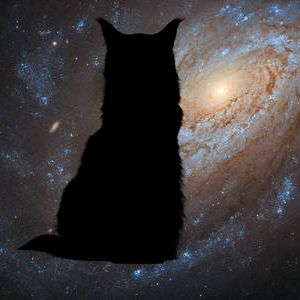
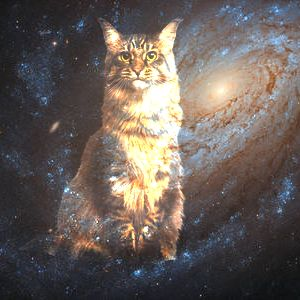
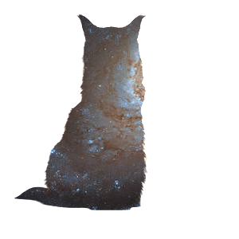

[](https://sharp.pixelplumbing.com)

So, you want to resize, scale, filter, explode images, but you don't know where to start? Working with images can be a bit of a minefield, there's a handful of ways to accomplish a simple resize. What's ImageMagick? What's GraphicsMagick? Should I use a Python script, or maybe there's something written in Go? - We're not building Cloudinary, so let's avoid the distractions and go with as much abstraction as possible. 

In the spirit of the majority of my blog posts, I reached for the highest abstraction I could find outside Cloudinary, and landed on a JavaScript (_yay!_) library by the name of "Sharp". Sharp is an image processing... _module?_ that uses libvips under the hood to optimise your image operations. In short, this means you won't be writing wrappers and utils around it yourself and all you need to do is write a few lines of JavaScript to get started.

Jump into a new project folder, and run a quick `yarn add sharp`. Once it's downloaded and ready to go, create a new file `touch app.js` and write a few lines of code. The following will resize an image in the folder `images/`, and output it at the root of your project as `output.jpg`

```javascript
const sharp = require('sharp')

sharp('./images/1.png')
  .resize(300, 300)
  .toFile('output.jpg', function(err) {
    console.log("error: ", err)
  });
```

Once you've written the above, in your terminal, type a `node app.js`, and you will receive a new file with dimensions 300px x 300px. So that's all well and good, but we want to overlay two images over each other. There's a function for that called "composite".

My first instinct was to do the following, where `1.png` in the underlying image of `2.png`:

```javascript
const sharp = require('sharp')

sharp('./images/1.png')
   .composite([{ 
    input: './images/2.png'
  }])
  .toFile('output.jpg', function(err) {
    console.log("error: ", err)
  });
```

But you can run into some issues, namely image size matching. If the underlying image is smaller than the overlaying image, it's not going to work. The composite function doesn't allow you to pass any sort of mutators or sizing inside it, just an image. It accepts either a `String` to the location of the file or a `Buffer`.

So, we got to resize the image first, or, resize both, and then try to overlay them over each other. To do this, you'll be looking at something like the following:

```javascript
const sharp = require('sharp')

sharp('./images/1.png')
  .resize(300, 300) // Resize the image
  .toBuffer({ resolveWithObject: true }) // We want it to a buffer
  .then(({ data, info }) => {  // We now have the data / info of that buffer
    sharp('./images/2.png') // Let's start a new sharp on the underside image 
      .resize(300,300) // Resize the underside image
      .composite([{ 
        input: data // Pass in the buffer data to the composite function
      }])
      .toFile('output.jpg', function(err) {
        console.log("Error: ", err)
      });
    console.log(info);
  })
  .catch(err => { 
    console.log("Error: ", err);
  });
```

BUT, our images seem a little, cropped... So we're almost there! We just need to use the "fit" parameter. 9 times out of 10 you will probably go with contain. To achieve this in Sharp, let's go with the following:

```javascript
const sharp = require('sharp')

sharp('./images/1.png')
  .resize({
    fit: sharp.fit.contain, // Pass in the fit type.
    height: 100, // Let's make it a little smaller than the underlying image.
    width: 100
  })
  .toBuffer({ resolveWithObject: true }) 
  .then(({ data, info }) => { 
    sharp('./images/2.png') 
      .resize(300,300) 
      .composite([{ 
        input: data 
      }])
      .toFile('output.jpg', function(err) {
        console.log("Error: ", err)
      });
    console.log(info);
  })
  .catch(err => { 
    console.log("Error: ", err);
  });
```

And now we're starting to look good! We've shrunk the image a little, and it's no longer cropped. But, turns out we have one small little problem left. You probably see some black bars on your buffered image. Turns out we got a bit overzealous with our containing. We just need to drop either the width or height - and we're good.


```javascript
const sharp = require('sharp')

sharp('./images/1.png')
  .resize({
    fit: sharp.fit.contain,
    height: 100
  })
  .toBuffer({ resolveWithObject: true }) 
  .then(({ data, info }) => { 
    sharp('./images/2.png') 
      .resize(300,300) 
      .composite([{ 
        input: data
      }])
      .toFile('output.jpg', function(err) {
        console.log("Error: ", err)
      });
    console.log(info);
  })
  .catch(err => { 
    console.log("Error: ", err);
  });
```

Composite is pretty handy, you can set a `top` and `left` parameter to place the image somewhere other than centre - remember to add both properties - or you can use `gravity` to slap it against a wall of the image. Gravity is useful when you don't want to handle some of the math that can be involved with placement, and you can add some blend modes to play around with how the image is placed. Like so `.composite([{ input: data, blend: "xor" }])`.


`xor` for example, is a great way to "punch shapes" into an image. Here is a picture of a cat punching through space.


`color-dodge` will create an "ethereal" effect.


And finally, `dest-atop` will create a silhouette effect for you, like this infinity cat.

Overlaying images is a great way to get started playing around with image manipulation. Hopefully, these images of cats in space have got the cogs turning in your head. What will you create? Let me know!