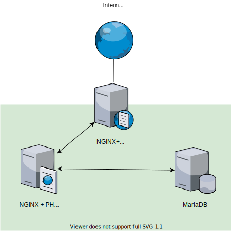

<h2 style="margin-bottom:0.5rem;">Preface</h2>

WordPress gets a pretty bad rap. In the era of "JavaScript the world™️", the case for choosing WordPress as part of your next tech stack is seen as passé - but let me tell you, sometimes boring and unfashionable is exactly what you need.

Thanks to the lack of extended framework features, like ORMs, lock files, templating, routing & other developer oriented tools - WordPress has a relatively easy deployment process, with a relatively easy management system. And you may not put two and two together immediately, but a relatively easy deployment process, lends itself to a great candidate for learning how to slap together a handful of cloud servers together - relatively easily.

In a nutshell, the same way you can just FTP your WordPress project up to a CPanel server, makes the same basis for you to build a deployment strategy on DigitalOcean, Vultr, AWS, Azure or GPC. Recently I was tasked with putting together a technology stack for WordPress, and came across "LEMP", which is another way of saying that you're running [NGINX](https://www.nginx.com) over [Apache](https://www.apache.org). Below is a primer to a LEMP stack I fell on, and some of the terminology I came across.

<h2 style="margin-bottom:0.5rem;">Technologies</h2>

<h3 style="margin-bottom:0.5rem;">Linux</h3>

- Typically Ubuntu, but other flavours also viable - mostly comes down to developer familiarity and preference.
- Majority of Linux distributions are GPL Licenced.
- Ubuntu has a comparatively lower barrier to entry, and online material much more available.

<h3 style="margin-bottom:0.5rem;">Nginx</h3>

- Webserver
- Can be run as a Reverse Proxy / Load Balancer on a seperate instance.
- Performance statistics and trends [stack in favour of Nginx over Apache]().

<h3 style="margin-bottom:0.5rem;">MariaDB</h3>

- Permissive GPL licence.
- MySQL, the traditional choice for this stack, has associated licencing costs that you may run into.
- Performance statistics tend to [stack in favour of MariaDB for req/s and error/s]().

<h3 style="margin-bottom:0.5rem;">PHP7-fpm</h3>

- Alternative FastCGI implementation with a larger feature set.
- [Faster performance than mod_php]().
- [PHP is GPL Lisenced]().

<h3 style="margin-bottom:0.5rem;">Varnish</h3>

- A HTTP Cache, that works in conjunction with Nginx to reduce server load.
- Significantly boosts performance.
- Two Clause BSD (Free GSD), [similar to GPL]().
- To get this to work with WordPress, some considerations need to be made, in particular adding an additional plugin to WordPress trigger page cache refreshes.

A note on HAProxy & Load Balancing

HAProxy can be used to Load Balance as an alternative to NGINX. For this particular strategy we will avoid over complicating the DSL idea that you need to juggle in your head, and stick with a small set of server technologies. As your project grows in traffic, you can always add HAProxy in the front if it becomes required. In general, WordPress sites are predominately static pages, and as such don't need to hit the Application Layer frequently, and a Varnish + Nginx setup should be sufficient.

A note on Redis.

Redis is a key value store for object caching, to help reduce load on your database server. Typically, adding Redis may over complicate your installation, and may surface some hard to debug issues. By using Varnish, and if required a dedicated more sophisticated Load Balancing server setup in future, you can avoid calls to the Application Layer enough that you can subsequently reduce load on the Database Layer.

<h2 style="margin-bottom:0.5rem;">Setup</h2>

Online, you can find anecdotes of the above setup running on 2 droplets (machines/servers) on DigitalOcean, but a faster setup, that can reduce server load can be achieved by adding a third NGINX+Varnish as a Load Balancer + HTTP Cache.

On the surface this is a little intimidating on the surface. But you can deploy the above on a single server with docker compose. In a future blog post we will be looking at how to put together a few containers in docker, to emulate the above setup. 

If you're looking for more on this now, you can start with the following reference I found, which is a basis for the above suggestion, it's from 2017 but it's still valid for today. [Reference](https://evervee.me/tech-work/wordpress-ssl-php-fpm-nginx-varnish-nginx-sandwich/)
